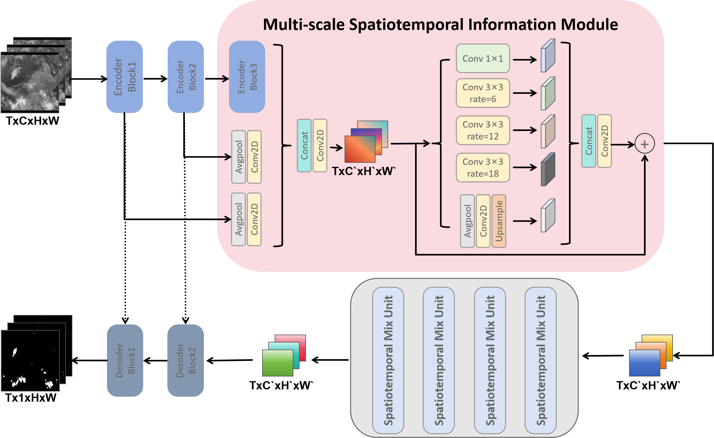

# MCSDNet: Mesoscale Convective System Detection Network via Spatiotemporal Infromation
This repository is the official implementation of the paper:
**MCSDNet: Mesoscale Convective System Detection Network via Spatiotemporal Infromation**
## Congratulation! Our paper is accepted by TGRS!
## Introduction

The accurate detection of Mesoscale Convective Systems (MCS) is crucial for meteorological monitoring due to their potential to cause significant destruction through severe weather phenomena such as hail, thunderstorms, and heavy rainfall. However, the existing methods for MCS detection mostly targets on single-frame detection, which just considers the static characteristics and ignores the temporal evolution in the life cycle of MCS. In this paper, we propose a novel encoder-decoder neural network for MCS detection(MCSDNet). MCSDNet has a simple architecture and is easy to expand. Different from the previous models, MCSDNet targets on multi-frames detection and leverages multi-scale spatiotemporal information for the detection of MCS regions in remote sensing imagery(RSI). As far as we know, it is the first work to utilize multi-scale spatiotemporal information to detect MCS regions. Firstly, we design a multi-scale spatiotemporal information module to extract multi-level semantic from different encoder levels, which make our models can extract more detail spatiotemporal features. Secondly, a Spatiotemporal Mix Unit(STMU) is introduced to MCSDNet to capture both intra-frame features and inter-frame correlations, which is a scalable module and can be replaced by other spatiotemporal module,for example, CNN, RNN, Transformer and our proposed Dual Spatiotemporal Attention(DSTA). This means that the future works about spatiotemporal modules can be easily integrated to our model. Finally, we present MCSRSI, the first publicly available dataset for multi-frames MCS detection based on visible channel images from the FY-4A satellite. We also conduct several experiments on MCSRSI and find that our proposed MCSDNet achieve the best performance on MCS detection task when comparing to other baseline methods. Particularly, MCSDNet shows remarkable capability in extreme conditions where MCS regions are densely distributed. We hope that the combination of our open-access dataset and promising results will encourage the future research for MCS detection task and provide a robust framework for related tasks in atmospheric science.


## Install
```
git clone https://github.com/250HandsomeLiang/MCSDNet.git
conda env create -f environment.yml
conda activate STCCD
```
## Dataset
We create and publicly share a Mesoscale Convective System Detection dataset based on the captured images from FY-4A satellite. You can get the dataset [here](https://github.com/250HandsomeLiang/MCSRSI.git)!
## How to use
train
```
python main.py -n 1 -g 1 -nr 0  --path Your Dataset
```
evaluate
```
python evaluate.py --path checkpoint.pth -n MCSDNet --dataset Your Dataset
```
generate
```
python generate.py --checkpoint checkpoint.pth --path Your Dataset
```
## Citation
If you are interested in our repository and our paper, please cite the following paper:
```
@article{liang2024mcsdnet,
  title={MCSDNet: Mesoscale Convective System Detection Network via Multi-scale Spatiotemporal Information},
  author={Liang, Jiajun and Zhang, Baoquan and Ye, Yunming and Li, Xutao and Luo, Chuyao and Fu, Xukai},
  journal={arXiv preprint arXiv:2404.17186},
  year={2024}
}
```
## Contact
If you have any questions, feel free to contact us through email (liangjiajun2002@163.com). Enjoy!
